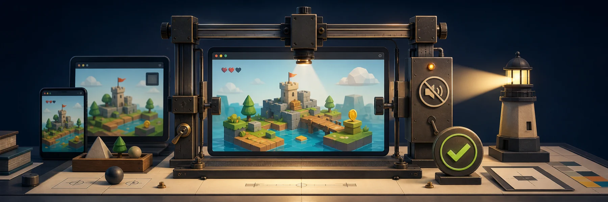

Game Harness turns a successful build into evidence: silent browser sessions,
deterministic device tiers, byte-exact screenshots, production-runtime proof,
and Lighthouse gates.

It is intentionally a focused library rather than a test framework. Your game
keeps its own journeys, assertions, art direction, and audio engine; Game
Harness supplies the reusable safety and orchestration layer around Playwright
and Vitest Browser Mode.

## Why Game Harness

:::cards
::card{title="Silent by construction" icon="volume-x"}
Chromium launches with `--mute-audio`, and tests wait for an application-owned
runtime mute marker before interacting.
::
::card{title="No accidental server reuse" icon="shield-check"}
CI ports are deterministic per job, preview commands use strict-port semantics,
and production verification refuses an already-reachable readiness URL.
::
::card{title="Visual evidence that fails closed" icon="camera"}
Screenshot baselines are scoped, profile-aware, and checked through Git without
fuzzy thresholds or shell interpolation.
::
::card{title="Real package boundaries" icon="package"}
Framework peers stay optional and isolated to subpath exports, with clean ESM,
CommonJS, type, CLI, and install smoke tests.
::
:::

Start with [Getting started](getting-started/) to choose the integration your
game needs.
